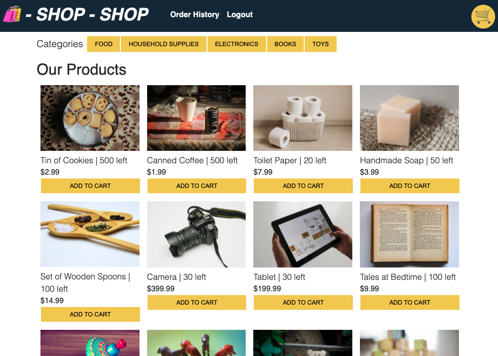

# Reudx Store

## Description

E-Commerce mockup built with React. The app uses an Express.js server and a NoSQL database with a GraphQL API. Users with an account may checkout via Stripe. The app is installable as a PWA.

The project was refactored to user Redux to manage global state, instead of the Context API.

View the deployed app on [Heroku](https://peaceful-earth-88980.herokuapp.com/).

## Usage
Users can create an account to purchase products. Users may use the homepage to add and remove products from the cart. Products can be filtered by category, and more details can be viewed by clicking the product image. Users with an account may checkout with Stripe.  

## Questions
For additional questions, contact Amelia:  
GitHub: amelia-was

## Built Using

**Front End**: HTML, CSS, React, JavaScript  
**Back End**: JavaScript, Node.js, Express.js, GraphQL

### License
Under the MIT license, this material is free to modify and distribute for commercial or private use. See here for more details.
